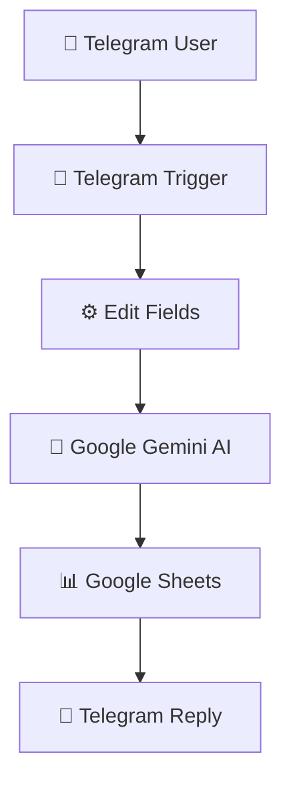

# 📄 AI Study Assistant — n8n Automation


An AI-powered educational chatbot built using **n8n**, **Google Gemini AI**, **Telegram Bot API**, and **Google Sheets**.

This workflow automatically receives study questions from Telegram users, generates intelligent educational responses using Google Gemini AI, stores conversation history in Google Sheets, and instantly replies through Telegram. It provides students with an always-available AI learning assistant while maintaining a searchable record of all interactions.

**Stack:**  
n8n · Google Gemini AI · Telegram Bot API · Google Sheets · JavaScript · AI Automation

---

# 🎯 Project Overview

## Problem

Students often need quick answers while studying, but traditional learning resources have several limitations:

- Learning support is not always available
- Searching for reliable information can be time-consuming
- Difficult concepts may require simplified explanations
- Study conversations are rarely saved for future review
- Manual tutoring can be costly or inaccessible

Common use cases include:

- Programming questions
- IT and computer science concepts
- Homework assistance
- Exam preparation
- General educational inquiries

---

## Solution

This project creates an AI-powered study assistant by:

1. Receiving questions through Telegram
2. Extracting user information
3. Sending questions to Google Gemini AI
4. Generating educational responses
5. Logging conversations into Google Sheets
6. Sending AI-generated answers back to Telegram

The workflow acts as a virtual study companion that provides instant educational assistance while maintaining a history of every conversation.

---

# ✨ Features

## AI Learning Assistant

✅ Google Gemini AI integration  
✅ Intelligent educational responses  
✅ Clear concept explanations  
✅ Friendly tutoring experience  

## Telegram Integration

✅ Automatic message detection  
✅ Instant AI replies  
✅ Real-time chatbot interaction  
✅ User-friendly interface  

## Data Management

✅ Google Sheets conversation logging  
✅ Learning history tracking  
✅ Structured chat records  
✅ Automatic data storage  

## Automation

✅ Fully automated workflow  
✅ Event-driven execution  
✅ No-code/low-code implementation  
✅ Scalable chatbot architecture  

---

# 🗺️ System Architecture



---

# 🏗️ Workflow Implementation

# Workflow 1: AI Study Assistant Pipeline

## Node 1 — Telegram Trigger

### Purpose

Monitor incoming Telegram messages from users.

Configuration:

```text
Trigger:

New Message

Updates:

Message

Polling:

Automatic
```

Captured Information:

| Field | Description |
|---|---|
| User Message | Student's question |
| Chat ID | Telegram chat identifier |
| User Name | Sender's name |

---

# Node 2 — Edit Fields

### Purpose

Prepare user information before sending it to Google Gemini AI.

Extracted Data:

| Field | Description |
|---|---|
| userMessage | Student's question |
| chatId | Telegram Chat ID |
| userName | Telegram user |

Example:

```json
{
"userMessage":
"What is the difference between CPU and GPU?",

"userName":
"John",

"chatId":
"123456789"
}
```

---

# Node 3 — Google Gemini AI

### Purpose

Analyze the student's question and generate an educational response.

The AI is instructed to:

- Explain concepts clearly
- Keep responses concise
- Use examples when appropriate
- Break complex topics into simple steps
- Maintain an educational tone

Example Prompt:

```text
You are an AI Study Assistant.

Explain concepts clearly and simply.

Use examples when appropriate.

Keep answers concise.

Break difficult topics into smaller steps.

User Question:

{{userMessage}}
```

Example Response:

```text
CPU stands for Central Processing Unit.

It executes instructions and performs calculations required by programs.

Example:

When you open a browser, the CPU processes the instructions needed to launch the application.
```

---

# Node 4 — Google Sheets

### Purpose

Store every conversation for future reference and analytics.

Database Structure:

| Field | Description |
|---|---|
| Timestamp | Processing time |
| User Name | Telegram user |
| User Message | Student question |
| AI Response | Gemini answer |

Example:

| User | Question |
|---|---|
| John | What is RAM? |

---

# Node 5 — Telegram

### Purpose

Send the AI-generated educational response back to the user.

Example:

```text
🤖 AI Study Assistant

CPU stands for Central Processing Unit.

It is considered the "brain" of the computer because it processes instructions and performs calculations.

Example:

When you launch a web browser, the CPU executes the instructions required to start the application.

Powered by Google Gemini AI.
```

---

# 🔐 Credentials Required

| Service | Purpose |
|---|---|
| Telegram Bot API | Receive and send messages |
| Google Gemini API | Generate AI responses |
| Google Sheets OAuth2 | Store conversation history |
| n8n Instance | Workflow execution |

---

# ⚙️ Setup Guide

## 1. Configure Telegram Bot

Create a Telegram bot using BotFather.

Required:

```text
Telegram Bot Token

Chat ID

Telegram Credentials
```

Test incoming messages.

---

## 2. Configure Google Gemini AI

Create Gemini API credentials.

Required:

```text
Google AI API Key

Gemini Model Access
```

Test AI response generation.

---

## 3. Create Google Sheets Database

Create:

```text
AI Study Assistant Logs
```

Columns:

```text
Timestamp

User Name

User Message

AI Response
```

---

## 4. Import Workflow

Import:

```text
workflow.json
```

Configure:

- Telegram Bot
- Google Gemini AI
- Google Sheets

Activate the workflow.

---

# 🧪 Testing Checklist

| Test Case | Expected Result |
|---|---|
| Send Telegram message | Workflow starts |
| Edit Fields executes | Data prepared |
| Gemini analyzes question | AI response generated |
| Google Sheets updates | Conversation logged |
| Telegram replies | User receives answer |

---

# 📁 Repository Structure

```text
AI-Study-Assistant/

│
├── README.md
│
├── workflow.json
│
├── screenshots/
│   │
│   ├── workflow.png
│   ├── telegram-trigger.png
│   ├── edit-fields.png
│   ├── ai-agent.png
│   ├── google-sheets.png
│   ├── telegram-response.png
│   └── workflow-execution.png
│
├── assets/
│   └── sample-conversation.txt
│
└── LICENSE
```

---

# 📸 Screenshots

Recommended screenshots:

* Complete workflow
* Telegram Trigger configuration
* Edit Fields node
* Google Gemini AI output
* Google Sheets records
* Telegram chatbot response
* Workflow execution result

---

# 🚀 Future Improvements

| Feature | Implementation |
|---|---|
| Conversation Memory | Multi-turn AI chats |
| Voice Message Support | Speech-to-text integration |
| Quiz Generator | Automatic practice questions |
| PDF Analysis | Study material processing |
| Multi-language Support | Global accessibility |
| Student Dashboard | Learning analytics |
| Notion Integration | Knowledge management |
| Learning Recommendations | Personalized study plans |

---

# 🎓 Skills Applied

## Automation

* n8n Workflow Automation
* Event-driven workflows
* Chatbot automation

## Artificial Intelligence

* Google Gemini AI
* Prompt Engineering
* AI educational assistant
* AI response generation

## APIs

* Telegram Bot API
* Google Sheets API
* Google Gemini API

## Programming

* JavaScript
* JSON processing
* Data transformation
* Workflow logic

## Business Automation

* AI chatbot development
* Educational automation
* Productivity workflows

---

# 📚 Learning Objectives

This project demonstrates:

* Building AI-powered chatbot workflows
* Integrating Telegram with n8n
* Using Google Gemini AI for educational assistance
* Logging structured conversation data
* Designing scalable AI-powered learning systems

---

# 🙌 Acknowledgements

* n8n
* Google Gemini AI
* Telegram Bot API
* Google Sheets API

---

# 👨‍💻 Author

**Belio C. Sinangote**

BS Information Technology Student  
Cebu Technological University (CTU)

GitHub:

https://github.com/belioautomation

This project is part of my **30-Day n8n Automation Portfolio**, showcasing practical automation solutions using **n8n, AI integrations, APIs, and business workflow automation**.

---

# 📄 License

MIT License
